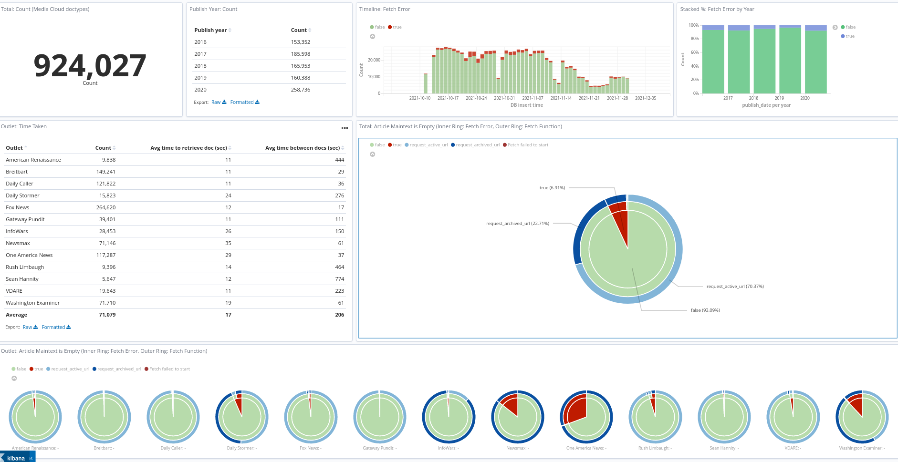

# Kibana

## Monitor data collection
  

## Add Saved Objects from 'production' version of the project
- "Management" -> "Kibana: Saved Objects" -> "Import"
- Import `kibana-objects.json`

## Mapping

### Case 1: no `inca_alias` index has been created yet (INCA scraping has not started)
1. Copy-paste the HTTP request in `inca-index-and-mapping.txt` into Dev Tools
2. Add the alias
```
POST _aliases
{
    "actions": [
        {
            "add": {
                "index": "inca",
                "alias": "inca_alias"
            }
        }
    ]
}
```
3. When INCA starts adding documents, it should be sending them to `inca_alias`, which then points to the actual index called `inca`.

### Case 2: `inca_alias` index already exists (INCA scraping already started)

The project version of INCA connects automatically to `inca_alias`. When scraping has already started, documents are added directly to an *index* called `inca_alias` (rather than to an actual alias). The Kibana dashboard, "US Right Media (URLs)", refers to `inca_alias` as well.

To make `inca_alias` become an actual alias rather than an index:
1. Stop scraping
2. Copy-paste the HTTP request in `inca-index-and-mapping.txt` into Dev Tools
3. Re-index the old `inca_alias` index into the new `inca` index

```
POST _reindex
{
    "source": {
        "index": "inca_alias"
    },
    "dest": {
        "index": "inca"
    }
}
```
4. delete the existing `inca_alias` index
```
DELETE /inca_alias
```
5.  and correctly add the alias as pointer to the `inca` index
```
POST _aliases
{
    "actions": [
        {
            "add": {
                "index": "inca",
                "alias": "inca_alias"
            }
        }
    ]
}
```

### Case 3: switch `inca_alias` from `inca` to `inca_v2`

If `inca` is re-mapped to `inca_v2`, update the alias reference in one go.

>Renaming an alias is a simple remove then add operation within the same API. This operation is atomic, no need to worry about a short period of time where the alias does not point to an index [(docs)](https://www.elastic.co/guide/en/elasticsearch/reference/6.8/indices-aliases.html)

```
POST _aliases
{
    "actions": [
        {
            "remove": {
                "index": "inca",
                "alias": "inca_alias"
            }
        },
        {
            "add": {
                "index": "inca_v2",
                "alias": "inca_alias"
            }
        }
    ]
}
```

## Fix dashboard error
- To fix this error,
```
Request to Elasticsearch failed:

{
    "error": {
        "root_cause": [
            {
                "type": "illegal_argument_exception",
                "reason": "Trying to retrieve too many docvalue_fields. Must be less than or equal to: [100] but was [134]. This limit can be set by changing the [index.max_docvalue_fields_search] index level setting."
            }
        ]

        ...
    }
}

```

- enter this PUT request into Dev Tools
```
PUT /inca_alias/_settings
{
    "index.max_docvalue_fields_search": 200
}
```


## Fix timezone display

Kibana defaults to using the browser's timezone. Change it to `UTC`.
- "Management" -> "Advanced Settings" -> "Timezone for date formatting"
- select "UTC"